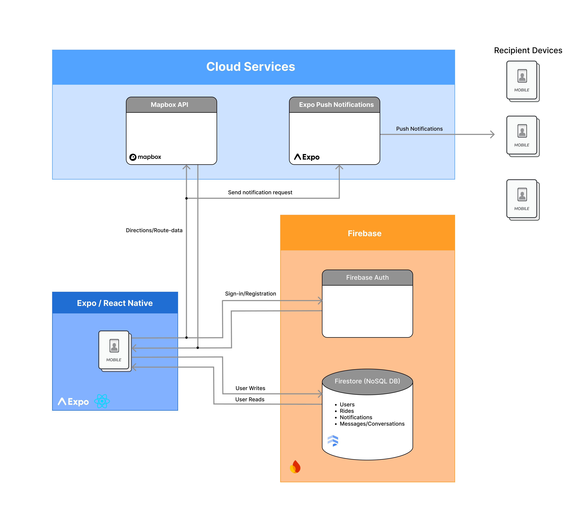

# UCSB Rideshare App – Design Document

# Introduction

This design document describes the architecture, product rationale, and implementation plan for our rideshare app for the UCSB community. The project is grounded in a user-centered problem scenario and journey analysis, and was refined through sprint-based team decisions recorded in our repository meeting logs. Our goal is to deliver a reliable product that supports the core rider flow: request a ride, get matched, complete the trip, and handle post-ride actions clearly and safely.

This document explains how product decisions (scope, UX flow, and priorities) map to technical decisions (component structure, testing strategy, and iteration plan). It also captures tradeoffs made during development, including adjustments after MVP demo feedback, as well as the team practices that supported overall app quality and progress.

---

# System Architecture Overview

  

The rideshare application follows a **client-centric architecture**
built with Expo / React Native, leveraging Firebase as a
Backend-as-a-Service (BaaS) and integrating third-party cloud services
for maps and push notifications. There is no custom backend server;
instead, the mobile client communicates directly with Firebase and
external APIs.

------------------------------------------------------------------------

## Client Layer: Expo / React Native Mobile App

The mobile application is built using **Expo and React Native**, and
serves as the primary interface for users. All user
interactions, including authentication, ride creation, ride browsing,
messaging, and notifications, originate from the client.

The client is responsible for:

-   Handling UI and state management\
-   Authenticating users via Firebase Authentication\
-   Reading and writing ride and message data to Firestore\
-   Requesting map data from the Mapbox API\
-   Sending push notification requests to Expo Push Notifications

Because the system does not include a custom backend, the client
communicates directly with all cloud services.

------------------------------------------------------------------------

## Firebase Backend (Backend-as-a-Service)

Firebase provides authentication and real-time database functionality.

### Firebase Authentication

Firebase Authentication handles user sign-in and registration. When a
user logs in or registers:

1.  The mobile app sends authentication credentials to Firebase Auth.
2.  Firebase validates the credentials.
3.  An authentication token is returned to the client.
4.  This token is used to authorize all future Firestore requests.

This ensures that all database access is secure and tied to
authenticated users.

------------------------------------------------------------------------

### Firestore (NoSQL Database)

Cloud Firestore serves as the application's primary data store and
real-time synchronization layer.

Firestore contains the following core collections:

-   **Users** -- profile and account information\
-   **Rides** -- ride postings and ride details\
-   **Notifications** -- stored notification data\
-   **Messages/Conversations** -- chat messages between users

The mobile app performs:

-   **User Writes**: creating rides, joining rides, sending messages,
    updating profiles\
-   **User Reads**: fetching ride listings, loading chat conversations,
    retrieving notifications

Firestore's real-time listeners allow updates, such as new messages or
ride changes, to automatically propagate to connected clients without
polling.

Because there is no dedicated messaging server, Firestore functions both
as the persistent data store and the real-time messaging transport
layer.

------------------------------------------------------------------------

## Mapbox API (Cloud Service)

The Mapbox API is used to provide:

-   Map tile rendering\
-   Route generation and directions\
-   Location-based services

The mobile application directly sends requests to Mapbox for route data
and receives directions/route responses. These interactions are
independent of Firebase and occur strictly between the client and
Mapbox's cloud service.

------------------------------------------------------------------------

## Expo Push Notifications

Expo Push Notifications handles delivery of push notifications to
recipient devices.

The flow is as follows:

1.  The mobile app sends a push notification request to the Expo Push
    API.
2.  Expo processes the request and delivers the push notification.
3.  Recipient devices receive the notification.

Push notifications are used for events such as:

-   New ride updates\
-   New messages\
-   Ride cancellations

The system does not use Firebase Cloud Functions; notification requests
are triggered directly from the client.

# Summary of Team Decisions

Since the beginning of the project, the team has made several consistent decisions that shaped both our process and product direction, as reflected in sprint meeting logs and team documentation.

1. **Prioritizing explicit collaboration structure early.**  
   An early team decision was to formalize operating practices rather than rely on informal coordination. This included defining role clarity, communication norms, and decision ownership. (See: `AGREEMENTS.md`, `NORMS.md`, `LEADERSHIP.md`, sprint meeting notes)

2. **Making explicit MVP tradeoffs and revisiting features after feedback.**  
   The team intentionally created a barebones app for the MVP release. We agreed to limit scope in order to deliver a stable and complete core experience. After the MVP demo, we revisited feature ideas and incorporated feedback following Agile methodology. (See: `MVP_DEMO.md`, `MVP_FOLLOWUP.md`, sprint meeting notes)

3. **Aligning features with documented scenario and journey artifacts.**  
   As we iterated on the app, we made a deliberate decision to ensure that each change aligned with documented user value from our problem scenario and user journey artifacts. This prevented us from adding features based solely on technical convenience. (See: `problem_scenario.md`, `user_journey.md`)

---

# User Experience Considerations

## High-Level Task / User Flow

The following outlines the primary app flow for driver and rider interaction. Edge cases and additional functionality are addressed in later sections.

1. **Start / Account Setup:**  
   Users enter the app and either register for a new account or log into an existing account. Registration requires UCSB-affiliated credentials to maintain community trust and safety.

2. **Joining a Ride:**  
   Users can browse available rides and choose which ones to join. Each ride listing displays the destination, departure time, available seats, and price so riders have the necessary information before requesting to join.

3. **Hosting a Ride:**  
   Users with a vehicle attached to their account can host a ride. They specify the destination, departure time, available seat count, price per rider, and cancellation deadline. The hosted ride then appears on the available rides list for others to join.

4. **Messaging:**  
   When a rider joins a ride, all participants are placed into a group chat with in-app messaging to support communication between riders and the driver. The chat is created when a rider joins and archived after the ride is marked complete. If a rider leaves before departure, they are removed from the group chat.

5. **Cancellation Policy and Payments:**  
   Users may cancel hosted rides with no fee. Riders may leave rides without penalty until the cancellation deadline set by the host, which is defined as a fixed window before departure time. After this deadline, leaving may incur a penalty cost to discourage last-minute cancellations. Full payment implementation is deferred post-MVP; the current MVP uses an honor system where riders are provided the driver’s Venmo or Zelle handle to complete payment outside the app.

6. **Completion and Post-Ride Actions:**  
   Ride completion is triggered by the driver. This clears the ride state from users’ landing pages and moves the ride to ride history for all participants. Any outstanding payments are settled at this stage. Users are prompted to leave an optional review and rating, which are stored internally and displayed on a host’s profile for future riders.

---

## Additional UX Considerations

- Restricted to valid `@ucsb.edu` users to create community trust  
- Users can view past rides and transaction history to track app usage  
- In-app notifications to drivers and riders when rides are joined and when group chats are active to streamline communication  
- Map integration to help users visualize locations and simplify location entry through dropdowns  
- Profile customizations that allow users to build familiarity within the community  
- Cancellation rules and policies handled by the app according to a standard basic cancellation policy rather than relying on informal agreements between drivers and riders

